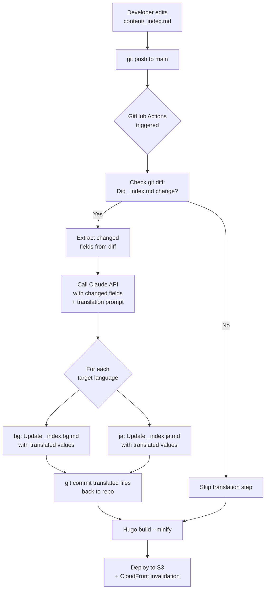

# Auto-Translation Workflow

When `content/_index.md` (English) is edited and pushed, a GitHub Actions pipeline can automatically translate changed fields and update the other language files.



## Notes

- Only **changed fields** are sent to the API (via `git diff`), not the full file.
- The Claude API prompt instructs: *"Translate only the changed YAML values from English to the target language. Return valid YAML only, preserving all keys exactly."*
- `ANTHROPIC_API_KEY` is stored as a GitHub Secret.
- Auto-translation commits are tagged `chore: auto-translate` for easy identification in git history.
- `data/testimonials.yaml` would need a separate similar flow if updated.
```
